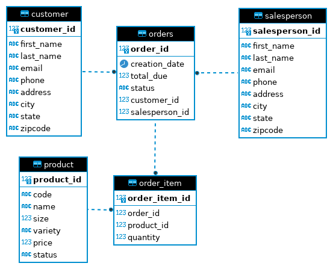

# JDBC Data Access and Transactions
## Introduction
This application is a training for Jarvis Software Engineer Training, and it serves as a sample workflow for JDBC, which allows a connection between a Java application and an RDBMS. As a developer, understand DAO (Data Access Object), DTO (Data Transfer Object), and Repository design, as well as some advanced JDBC concepts is a must.

## Entity Relationship Diagram


## Design Patterns
There are two main design patterns in JDBC:
### Data Access Object (DAO)
Data Access Object Pattern or DAO pattern is used to separate low level data accessing API or operations from high level business services. Following are the participants in Data Access Object Pattern.

- **Data Access Object Interface** : This interface defines the standard operations to be performed on a model object(s).

- **Data Access Object concrete class** : This class implements above interface. This class is responsible to get data from a datasource which can be database / xml or any other storage mechanism.

- **Model Object** or **Value Object** : This object is simple POJO containing get/set methods to store data retrieved using DAO class.
### Repository Pattern
Repositories are classes or components that encapsulate the logic required to access data sources. 
- They centralize common data access functionality, providing better maintainability and decoupling the infrastructure or technology used to access databases from the domain model layer
-  A repository performs the tasks of an intermediary between the domain model layers and data mapping, acting in a similar way to a set of domain objects in memory

## Testing 
Testing in this application was done by using a combination of Dbeaver, Docker PostgreSQL, IntelliJ IDEA built-in debug system, and error handlings in codes
- ```Dbeaver```: Used to view Entity Relationship Diagram of tables in the ```hplussport``` database
- ```Docker PostgreSQL```: Used to view tables and inserted/updated/deleted data.
- ```IntelliJ IDEA built-in debug and error handlings```: Used to view where errors during run time happen
