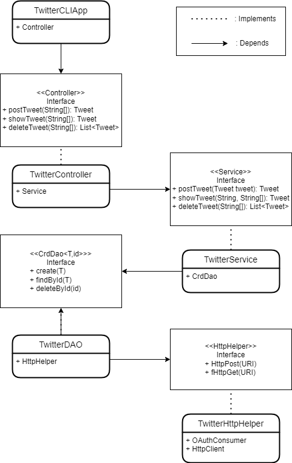

# Twitter Controller App
## Introduction
 The Twitter Controller App is designed to utilize, by using REST API to send HTTP requests to Twitter Server:
 + To post a tweet, with coordinates [longitude, latitude].
 + To show a tweet by using its ID.
 + To delete a tweet using its ID.

This application is developed using multiple technologies and frameworks: OAuthProtocol 1.0, Twitter REST API, Spring Boot, and Spring Framework, Maven, JUnit, Mockito, etc.

## Architecture Diagram

![IntelliJ Twitter Diagram] (./assets/IntelliJTwitterDiagram.png)

## Usage
- To post a tweet and its coordinates: ``` TwitterApp post [tweet text] [longitude: latitude] ```
- To show a tweet using its ID: ``` TwitterApp show [tweet id] [field1,field2 (optional)]```
- To delete a tweet using its ID: ``` TwitterApp delete [tweet id] ``` (You can delete multiple tweets at once using an ID array)
### Using Docker to run the app
``` docker run --rm -e consumerKey=YOUR_VALUE -e consumerSecret=YOUR_VALUE -e accessToken=YOUR_VALUE -e tokenSecret=YOUR_VALUE jrvs/twitter_app post | show | delete [options]```
### Using Maven to run the app
* To build the package, proceed to the Twitter directory and run `mvn clean package` in the command window.
* To run this app, under twitter directory, run `java -jar target/java_apps-1.0-SNAPSHOT.jar [action] [option(s)]` in the command window. The usage for different actions (post, show, and delete) will be presented in the following sections.

## Design
### Components
#### TwitterHttpHelper
*  Makes a connection between the application and the Twitter server to post, show, or delete a tweet using consumer key, consumer key secret, access token, and token secret that you can get from your Twitter developer portal
#### TwitterDao
* Converts the input from Tweet object to URI format and then invokes POST or GET method defined in the TwitterHttpHelper.
#### TwitterService
* Validates the input and invoke methods defined in TwitterDao if the input is in the correct format
	* ID needs to be 19 characters long.
	* Tweet text cannot exceed 140 characters.
#### TwitterController
*  Validates the input from the command line, converts the input to the correct data type, and then invokes the methods defined in the TwitterService.
#### TwitterCLIApp
*  Capture inputs from the command line and invoke methods defined in TwitterController if the input is not empty.
* 
### Models
TwitterApp is designed with the well-known MVC (minus V) architecture(design pattern). The application consists of the following components:
- **Model**: we use the same Tweet model as Data Transfer Model (or DTO) and Data access model (or domain model)
```JSON
//Simplified Tweet Object 
{ "created_at":"Mon Feb 18 21:24:39 +0000 2019", 
"id":1097607853932564480, 
"id_str":"1097607853932564480", 
"text":"test with loc223", 
"entities":{ 
"hashtags":[], 
"user_mentions":[] 
}, 
"coordinates":null, 
"retweet_count":0, 
"favorite_count":0, 
"favorited":false, 
"retweeted":false 
}
```
- **Controller**: The controller layer interacts and parsers user input (CLI args in this APP). It also calls the service layer and returns results.
- **Service**: The service layer handles business logic and calls the DAO layer to interact with the underlying storage/service which is the Twitter REST API in this app.
- **Data Access Layer**: 	The data access layer handles models (implemented with POJOs). In this app, the DAO layer save/show/delete tweet(s).

### Spring
The TwitterCLIApp has 3 different versions:

**The traditional method:**
Passing 3 arguments through the command line, and invoking methods from the Controller and Service Layers

**Spring Framework Implementations:**
Using Beans method:
1.  Define dependency relationship using `@Bean` and pass dependencies through method arguments
2.  Create an IoC container/context which will automatically instantiate all Beans base on the relationship you specified in the previous step.
3.  Get the main entry point (TwitterCLIApp) from the IoC container and start the program.

Using `@Component` method:
- Use @Autowired annotation to tell the IoC container to inject dependency through the constructor.
- `@Controller` annotation for 	`TwitterController`
- `@Service` annotation for `TwitterService`
- `@Repository` annotation for `TwitterDAO`
-  `@Configuration` annotation for `TwitterCLIComponentScan` `@ComponentScan(value = "ca.jrvs.app.twitter)`

**Spring Boot Implementations:**
- Use `@SpringBootApplication` on `TwitterCLISpringBoot` to define a SpringBoot app. `@SpringBootApplication` is a composition of multiple annotations which help you to configure Spring automatically.
- ``SpringApplication`` implements the ``CommandLineRunner ``interface which requires to implement a run(args) method.
## Test
This application is tested using 2 main methods:
- **Integration Testing**: JUnit 4.0 is used to test different methods for each component.
- **Unit Testing**: Mockito is used to test the Java Application Units.

## Deployment
For deployment:
* To build the package, proceed to the Twitter directory and run `mvn clean package` in the command window.
* To dockerize the app: 

``cd core_java/twitter``

``docker_user=your_docker_id
docker login -u ${docker_user} --password-stdin``

``cat > Dockerfile << EOF FROM openjdk:8-alpine COPY target/twitter*.jar /usr/local/app/grep/lib/twitter.jar ENTRYPOINT ["java","jar","/usr/local/app/grep/lib/twitter.jar"] EOF``

- Package your Java app :
``mvn clean package ``
- Build a new docker image locally 
``docker build -t ${docker_user}/twitter .`` 
- Verify your image 
docker image ls | grep "twitter" 
- Run docker container:
``` docker run --rm -e consumerKey=YOUR_VALUE -e consumerSecret=YOUR_VALUE -e accessToken=YOUR_VALUE -e tokenSecret=YOUR_VALUE jrvs/twitter_app post | show | delete [options]```


## Improvements 
- Get more familiar with Spring Framework and Spring Boot
- More experience with Twitter REST API
- Change implementations from Twitter API v1.1 to Twitter API v2.0
