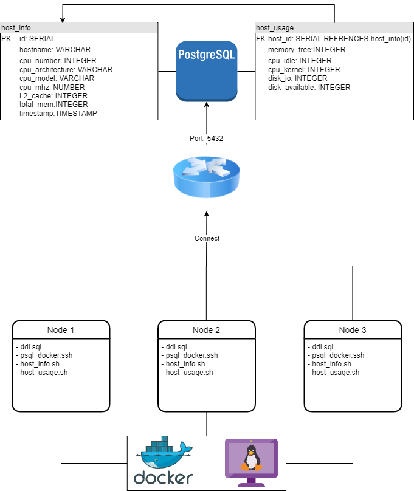

<<<<<<< HEAD
<<<<<<< HEAD
# Linux Cluster Monitoring Agent
## Introduction
- *This is the first coding project in the Jarvis Software Engineer Training Program provided by Jarvis Consultant Group.*

 The Linux Cluster Monitoring Agent is designed as a way to help users/engineers to gather system information and resource usage metrics from a Linux cluster into a database. A  Linux Cluster consists of different nodes, all of which can run same operating system to allow the program to collect convenient, and consistent sets of information, in this case, CentOS 7. These nodes are interconnected to a switch, and  data are sent to a server, physical or cloud to be inserted into a database.

 ## Architecture Diagram 


## Database Modeling
The database, ``` host_agent ```, consists of 2 different tables: ``` host_info ``` and ``` host_usage ```. 
- ``` host_info ``` table: stores hardware specification of a node. A host's system information are assumed to be constant, therefore, its data should only be inserted into this table once. A new data insertion can be processed automatically by using the ```/scripts/host_info.sh```.
	- ```id SERIAL```: The primary key of the table, refers to the order of data rows inserted in the table. It auto increments every time a new row is inserted, if the ```id``` is not specified
	- ```hostname VARCHAR```: The name of the host system
	- ```cpu_number INTEGER```: The number of CPU cores of the system
	- ```cpu_architecture VARCHAR```: The architecture of the system's CPU
	- ```cpu_model VARCHAR```: The model of the CPU in the system. The model name alone can tell the brand, generation, architecture and speed of the CPU
	- ```cpu_mhz NUMBER```: The clock speed of the CPU in the system
	- ```L2_cache INTEGER```: The size of the system's L2 cache
	- ```total_mem INTEGER```: The total uasble memory installed in the system
	- ```timestamp TIMESTAMP```: The current time stamp at which the new data row is being inserted into this table (Timezone : UTC)
	-  Constraints: ```UNIQUE(host_name)``` & ``` PRIMARY KEY(id)``` & ```NOT NULL``` for every column
- ```host_usage``` table: stores resource usage of a node: CPU, memory and disk usage. New data are insersted automatically every minute through the use of ```/scripts/host_usage.sh``` combined with ```crontab```
	- ```host_id SERIAL```: A foreign that  references the primary key ```id``` of table ```host_info```
	- ```memory_free INTEGER```: The current amount of total free memory in the node
	- ```cpu_idle INTEGER```: Percentage of CPU load idling of the system the moment data is captured and inserted into this table
	- ```cpu_kernel INTEGER```: Percentage of CPU load operating in the kernel of the system the moment data is captured and inserted into this table
	- ``` disk_io INTEGER```: Number of ongoing operations in the system
	- ```disk_available INTEGER```: The amout of disk space avaialbe in the system
	- ```CONSTRAINTS```: ```FOREIGN KEY(host_id) REFERENCES host_info(id)```

## Scripts and Usages
- ```psql_docker.sh```:
	- Usage: ```./scripts/psql_docker.sh start|stop|create [db_username][db_password]```
	- This script is used to set up | start | stop a container, and a PostgreSQL database in it using docker
- ```host_info.sh```: 
	- Usage: ```./scripts/host_info.sh psql_host psql_port db_name psql_user psql_password```
	- This script is used to read the system hardware specifications and data, assign them to variables and then construct ```INSERT``` statement through psql CLI tool```host_info.sh```:
	- Usage: ```./scripts/host_info.sh psql_host psql_port db_name psql_user psql_password```
	- This script is used to read resource usage and availabilty of the system, assign them to variables and then construct ```INSERT``` statement through psql CLI tool
- ```crontab```:
	- Usage: ```./scripts/host_info.sh psql_host psql_port db_name psql_user psql_password```
	- It is used to schedule the execution of the ```host_usage.sh``` automatically every minute
- ```queries.sql```: There are 3 functions in this file: Group hosts by hardware info, Average memory usage, and Detect host failure
- ```ddl.sql```:  Contains SQL codes to automate connection to the psql instance using docker on a container,  to create the ```host_agent``` database, the ```host_info``` table and the ```host_usage``` table

## Improvements
For now, as my skill are lacking, I haven't see anything particular that I can improve. But in the future, if there is someone better like another programmer, or a seniore developer, or a future boss, or myself (lol) that can show me some improvements, I would be very greatful
=======
>>>>>>> master
=======
<<<<<<< HEAD
# Linux Cluster Monitoring Agent
## Introduction
- *This is the first coding project in the Jarvis Software Engineer Training Program provided by Jarvis Consultant Group.*

 The Linux Cluster Monitoring Agent is designed as a way to help users/engineers to gather system information and resource usage metrics from a Linux cluster into a database. A  Linux Cluster consists of different nodes, all of which can run same operating system to allow the program to collect convenient, and consistent sets of information, in this case, CentOS 7. These nodes are interconnected to a switch, and  data are sent to a server, physical or cloud to be inserted into a database.

 ## Architecture Diagram 


## Database Modeling
The database, ``` host_agent ```, consists of 2 different tables: ``` host_info ``` and ``` host_usage ```. 
- ``` host_info ``` table: stores hardware specification of a node. A host's system information are assumed to be constant, therefore, its data should only be inserted into this table once. A new data insertion can be processed automatically by using the ```/scripts/host_info.sh```.
	- ```id SERIAL```: The primary key of the table, refers to the order of data rows inserted in the table. It auto increments every time a new row is inserted, if the ```id``` is not specified
	- ```hostname VARCHAR```: The name of the host system
	- ```cpu_number INTEGER```: The number of CPU cores of the system
	- ```cpu_architecture VARCHAR```: The architecture of the system's CPU
	- ```cpu_model VARCHAR```: The model of the CPU in the system. The model name alone can tell the brand, generation, architecture and speed of the CPU
	- ```cpu_mhz NUMBER```: The clock speed of the CPU in the system
	- ```L2_cache INTEGER```: The size of the system's L2 cache
	- ```total_mem INTEGER```: The total uasble memory installed in the system
	- ```timestamp TIMESTAMP```: The current time stamp at which the new data row is being inserted into this table (Timezone : UTC)
	-  Constraints: ```UNIQUE(host_name)``` & ``` PRIMARY KEY(id)``` & ```NOT NULL``` for every column
- ```host_usage``` table: stores resource usage of a node: CPU, memory and disk usage. New data are insersted automatically every minute through the use of ```/scripts/host_usage.sh``` combined with ```crontab```
	- ```host_id SERIAL```: A foreign that  references the primary key ```id``` of table ```host_info```
	- ```memory_free INTEGER```: The current amount of total free memory in the node
	- ```cpu_idle INTEGER```: Percentage of CPU load idling of the system the moment data is captured and inserted into this table
	- ```cpu_kernel INTEGER```: Percentage of CPU load operating in the kernel of the system the moment data is captured and inserted into this table
	- ``` disk_io INTEGER```: Number of ongoing operations in the system
	- ```disk_available INTEGER```: The amout of disk space avaialbe in the system
	- ```CONSTRAINTS```: ```FOREIGN KEY(host_id) REFERENCES host_info(id)```

## Scripts and Usages
- ```psql_docker.sh```:
	- Usage: ```./scripts/psql_docker.sh start|stop|create [db_username][db_password]```
	- This script is used to set up | start | stop a container, and a PostgreSQL database in it using docker
- ```host_info.sh```: 
	- Usage: ```./scripts/host_info.sh psql_host psql_port db_name psql_user psql_password```
	- This script is used to read the system hardware specifications and data, assign them to variables and then construct ```INSERT``` statement through psql CLI tool```host_info.sh```:
	- Usage: ```./scripts/host_info.sh psql_host psql_port db_name psql_user psql_password```
	- This script is used to read resource usage and availabilty of the system, assign them to variables and then construct ```INSERT``` statement through psql CLI tool
- ```crontab```:
	- Usage: ```./scripts/host_info.sh psql_host psql_port db_name psql_user psql_password```
	- It is used to schedule the execution of the ```host_usage.sh``` automatically every minute
- ```queries.sql```: There are 3 functions in this file: Group hosts by hardware info, Average memory usage, and Detect host failure
- ```ddl.sql```:  Contains SQL codes to automate connection to the psql instance using docker on a container,  to create the ```host_agent``` database, the ```host_info``` table and the ```host_usage``` table

## Improvements
For now, as my skill are lacking, I haven't see anything particular that I can improve. But in the future, if there is someone better like another programmer, or a seniore developer, or a future boss, or myself (lol) that can show me some improvements, I would be very greatful
=======
<<<<<<< HEAD
>>>>>>> b35f28b5d662d3bd0838e31dc35d49b3bb183125
=======
>>>>>>> master
>>>>>>> develop
>>>>>>> feature/profile
